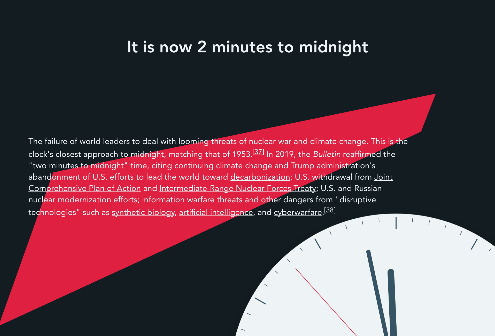

# Welcome to Vue Doomsday Clock 👋


[](https://github.com/Pterobyte/doomsday-clock/tree/master/LICENSE)
[](https://david-dm.org/pterobyte/doomsday-clock)
[](https://github.com/prettier/prettier)
[](https://twitter.com/CapnAwesome)



> A clock in vue fetching and displaying wikipedia's &#34;minutes to midnight&#34; from the Bulletin of the Atomic Scientists

### 🏠 [Homepage](https://pterobyte.github.io/doomsday-clock/)

## Install

```sh
yarn install
```

## Usage

```sh
yarn serve
```

## Run tests

```sh
yarn test
```

## Author

👤 **JT Houk**

* Twitter: [@CapnAwesome](https://twitter.com/CapnAwesome)
* Github: [@Pterobyte](https://github.com/Pterobyte)

## 🤝 Contributing

Contributions, issues and feature requests are welcome!

Feel free to check [issues page](https://github.com/Pterobyte/doomsday-clock/issues).

## Show your support

Give a ⭐️ if this project helped you!

<a href="https://www.patreon.com/TerminallyChillSoftware" rel="nofollow">
  
</a>


## 📝 License

Copyright © 2019 [JT Houk](https://github.com/Pterobyte).

This project is [MIT](https://github.com/Pterobyte/doomsday-clock/tree/master/LICENSE) licensed.
